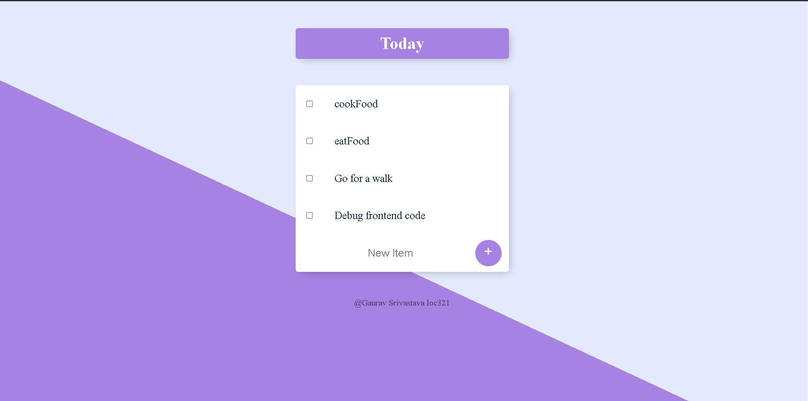
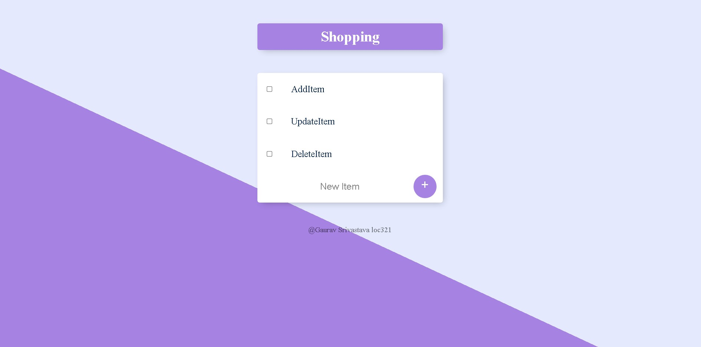

TODLIST 1.0 Application

A simple todo list application comprises of following features:

<h3> Create new list with different title</h3>
<h3>Add new item</h3>
<h3>Update new item</h3>
<h3>Delete new item</h3>

Connection with MangoDB Database

Pages made with the Embedded JavaScript Templating(EJS)

Node Backend Server 

Sample Images:

